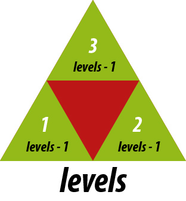
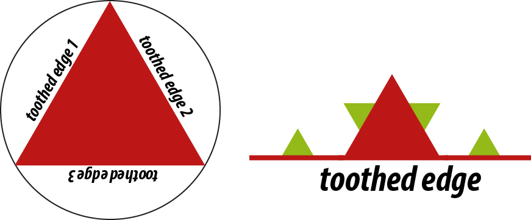
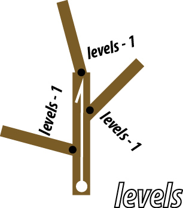

# Homework 2: make a scene

*Due: 9/18/2017*

For this assignment, I'd like you to make three drawings using OpenGL
code.  You will modify `scene.py`, the code provided here, so that it
displays each of these three drawings. They should result from making
`GL_TRIANGLE` vertex layout requests to draw basic shapes, along with
applying transformations to the coordinate frame---using `glScalef`,
`glTranslatef`, `glRotatef`---to place them appropriately within the
drawn scene. The drawings, you will find, are naturally "hierarchical"
and so you will want to issue `glMatrixPush` and `glMatrixPop` commands 
to save and restore coordinate frames while you make the drawing.

## The Assignment

Modify (or completely rewrite) `scene.py` so that it generates
each of these scenes:

* a simple drawing of your choice.
* a [sierpinski carpet](https://en.wikipedia.org/wiki/Sierpinski_carpet) or [sierpinski triangle](https://en.wikipedia.org/wiki/Sierpinski_triangle).
* a [Koch snowflake](https://en.wikipedia.org/wiki/Koch_snowflake).
* a recursive figure of a branched leaf, or something similar.

Make it so that the program user can select which scene is displayed by
pressing a digit key.

**simple drawing.** The drawing can be of anything, except it must be
in the *spirit* of my drawing. That drawing uses only a few graphics
primitives---a "unit" right triangle, a unit disk, a unit square, and
a 1x2 rectangle---but scales, rotates, and translates the coordinate
system so that, when these figures are drawn, they get placed all over
the screen to form the drawing.

**Sierpinski.** For the Sierpinski figure, you'll want to write a
recursive function that produces it, parameterized by a `levels`
parameter. This parameter will be used to drive the recursion. When
`levels == 0` you just draw the base geometric shape of the figure
(either a square or an equilateral triangle). When `levels > 0` you'll
instead recursively call this function several times---8 times for the
carpet, 3 times for the triangle---with each call made after a scaling
and translation of the coordinate frame.  For example, for the
triangle figure you'll scale the frame by 1/2rd, then call the
function with no translation, then with a unit translation along the
one side, and then a unit translation along the other side. You'll
need `glPushMatrix` and `glPopMatrix` to enter, then back out of the
(transformations made by these) recursive calls.  Note that each of
these recursive calls should be made with the parameter `levels - 1`.

**snowflake.** After an initial triangle is drawn, you'll want to
draw the three "toothed" sides of the triangle. You'll do this
with a function `def Koch_side(levels)`. This function should
act similarly to the Sierpinski function you write above. It
should behave recursively. For `levels > 0`, you'll make four
recursive calls to `Koch_side(levels - 1)`, to lay out the
four smaller toothed edges that form the toothed edge at this
level. For `levels == 0` you just draw a single triangular
tooth, centered on the edge. Note that at the highest level,
you'll be calling `Koch_side` three times, at three different
locations and orientations, to make the three sides of the
snowflake. Done right, because of the tooth layout, the three
sides around the top-level triangle will appear as a 6-pointed
snow flake.

**branched leaf**. This final figure is similar to the last two.  See
[this Wiki entry ](https://en.wikipedia.org/wiki/Barnsley_fern) or
[this page](http://www.home.aone.net.au/~byzantium/ferns/fractal.html)
for figures similar to what I'm requesting. I describe a method for
drawing this below. Incidentally, the method I describe is similar to
what's used by an L-system, rather than an Iterated Function System
(IFS), though the mathematics of the two schemes are similar. Using
the L-system method, we rely on coordinate transformations and
drawing a "base" versus a "recursive case" figure.

This figure is also recursive, and should be parameterized by
`levels`. We can think of the layout of a branched leaf figure as
having a "spine" of a vector ray, of a certain length, emanating from
some branch point.  This skeleton gives the overall scale and
direction of the figure. The figure itself is self-similar: part way
up the spine are three branch points. One at the tip of the ray, and
one on each side of the ray. Emanating from these three branch points
is a figure, just like the one we are describing, shooting off in
three directions, each at an angle off the spine, and each at a
smaller scale.

To draw this, you draw the spine ray as a thin brown rectangle.
You then draw two shoots off the spine for the other two
branches, also as thin brown rectangles. You then recursively
draw the figure with `levels - 1` emanating from these branch
points at their reduced scale. At the base case `levels == 0`
you draw a green leaf instead of the branched spine.

Make it so that keys on the keyboard allow the user to control
the shape of the "frond" produced, say, by allowing them to
control the angle of the shoots, etc. 

## Goals and Bonuses

The last three parts of this assignment are fully or mostly prescribed,
but I am open to you taking some freedoms and liberties in what you
produce, just so long as you are mimicking the drawing techniques
I'm suggesting. The key thing I want is to have the recursive
figures rely on transforming the coordinate system, while
pushing and popping the transformation "stack". If there are similar
figures you'd rather pursue for any of them, feel free to do so.
You are also welcome to instead produce their 3D equivalents.
If you do, you'll want to rely on code similar to what you used
for Homework 1.

## Report 

As always, document the choices you make, the nature of your code
and of your figures, cite any sources you rely upon, and let me
know about any bugs you have, or what does/doesn't work.

Include a text file `hw02/submitted.md` that tells me, briefly,
everything you completed for the assignment and the items and
info I listed just above.

## Submitting your work

Just as in Homework 1, you'll want to commit and push the changes 
you've made to the starting repository for this assignment. Do 
that by the end of next week.

